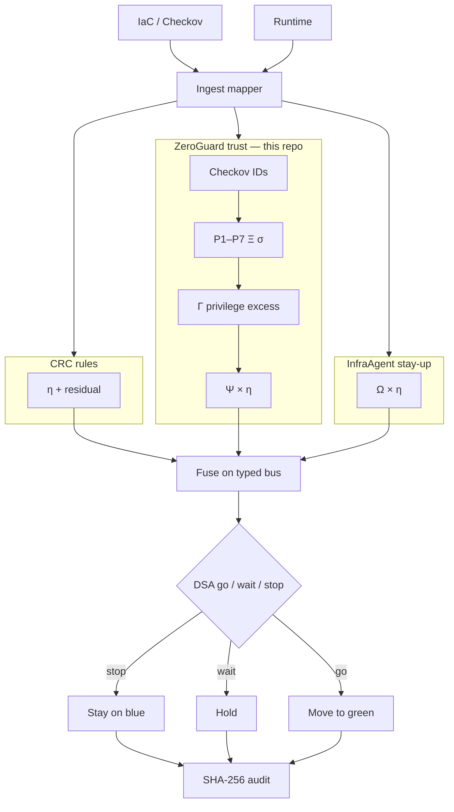
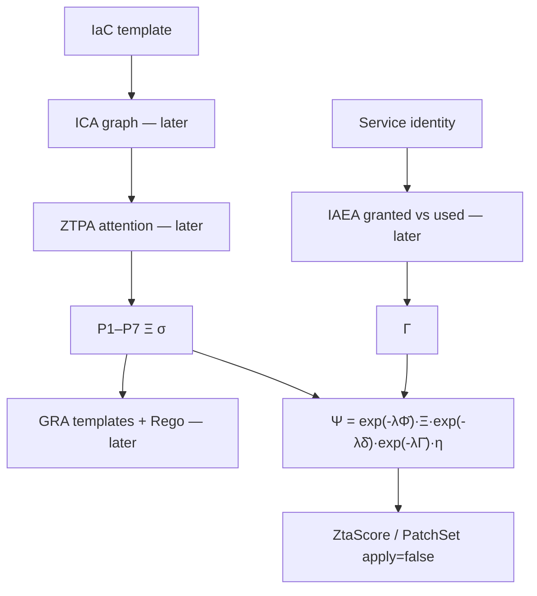
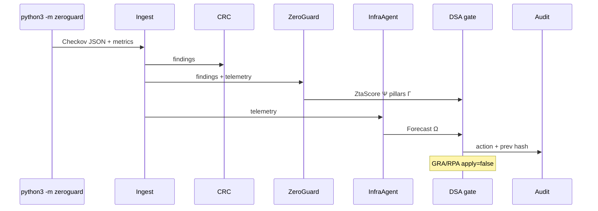

# Architecture — ZeroGuard trust plane

GitHub: [harishapuri/ZeroGuard](https://github.com/harishapuri/ZeroGuard)

This repo owns the **trust** plane (ZeroGuard, paper 2143). Question: open doors, extra permissions, unusual grants?

Scoring still runs the **fused** gate. CRC η, ZeroGuard Ψ, and InfraAgent Ω share one bus and one go / wait / stop. `--focus` only changes what the CLI prints. Library source: [unifiedframework](https://github.com/harishapuri/unifiedframework) (vendored here as `vendor/unified_framework`).

Sibling planes: [infraagent](https://github.com/harishapuri/infraagent) (rules), [CICD_Compliance](https://github.com/harishapuri/CICD_Compliance) (stay-up).

## This repo in the loop

```
Checkov JSON + optional telemetry
                ↓
Ingest (vendor/unified_framework)
                ↓
ZeroGuard pillars, Ξ, Γ, Ψ   ← this plane
CRC η · InfraAgent Ω         ← still computed
                ↓
Typed bus → DSA go / wait / stop
                ↓
GRA wins security attrs (suggest only) · SHA-256 audit · shadow unless --enforce
```

This repo does not auto-patch IAM or security groups.

## All in one — upstream to downstream



## ZeroGuard complete flow (paper 2143)



**Shipped in this repo:** classify each Checkov ID onto the same 7 NIST SP 800-207 pillars. Γ from IAM failures + `privilege_excess`. No auto-patch. GRA still wins the conflict rule when a suggestion exists. `python3 -m zeroguard --focus` prints trust plus the fused decision.

Open-door on **calm** traffic is the trust story: pillars drop and the fused gate still **stops**.

## Gate (same join as unified)

```
η multiplies both Ψ and Ω.

BLOCK  if  φ_1h > 0.7  OR  residual-high  OR  critical IaC
WARN   if  φ_6h > 0.5  OR  any ZTA pillar < 0.5  OR  κ > 0.15
PASS   otherwise → ALLOW

Conflict: GRA owns security attributes; RPA owns traffic and capacity.
Autonomy α2: never auto-apply IAM.
```

## One pipeline run



## Feedback loop

```
shadow pick  →  record actual  →  scorecard  →  ready_for_enforce?  →  --enforce
```

## File map (this repo)

| Path | Role |
| --- | --- |
| `zeroguard/cli.py` | Checkov → orchestrator; `--focus` / `--enforce` |
| `zeroguard/demo.py` | SSE site on http://127.0.0.1:8873/ |
| `zeroguard/automate.py` | Headless seven stories |
| `vendor/unified_framework/framework/zeroguard/` | Pillars, Ξ, Γ, Ψ |
| `.github/workflows/gate.yml` | Tests + automate + shadow pass |
